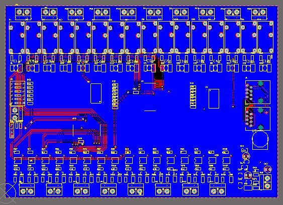
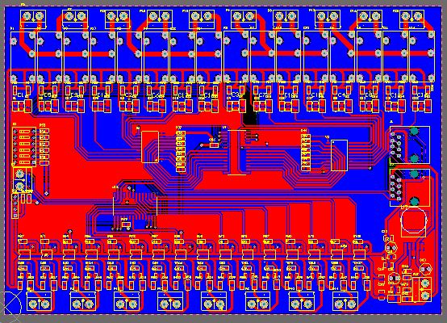
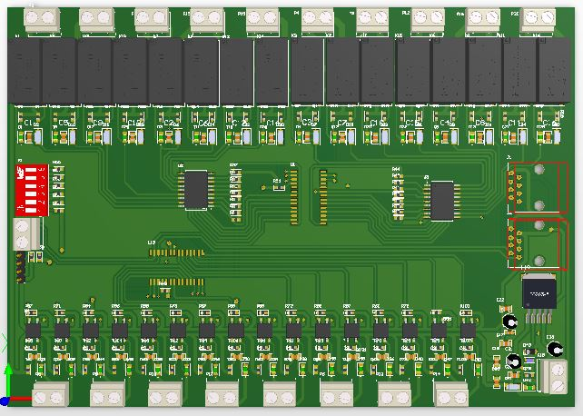

# ⚡ Relay Control Circuit via I2C (24V Power Supply) ⚡

## 📜 Schematic

📷 **Circuit Diagram:**  


## 🖼️ PCB Images

### 🔻 **Bottom Layer**


### 🔺 **Top Layer**


### 🎥 **3D View**


## 🛠️ Introduction
This circuit operates on a **24V power supply** and can control relays via **I2C communication**. The key components include:

- 🔹 **`MCP23017`**: GPIO expander with I2C interface.
- 🔹 **`ULN2803A`**: Darlington transistor driver for relay activation.
- 🔹 **`VOM617A-2T`**: Optocoupler for signal isolation.
- 🔹 **`Relay`**: Controls electrical loads by turning them on/off.
- 🔹 **`LM2596`**: Step-down module to convert **24V to 5V** for powering the microcontroller and MCP23017.
- 🔹 **`RJ45`**: Used for remote control signal connections.

## 📋 Circuit Diagram

- 🟢 **Main 24V power supply** for the entire system.
- 🟢 **LM2596** steps down **24V to 5V** to power MCP23017, ULN2803A, and the microcontroller.
- 🟢 **MCP23017** expands GPIO ports to control multiple relays.
- 🟢 **ULN2803A** amplifies current from MCP23017 to drive relays.
- 🟢 **Optocoupler VOM617A-2T** isolates the control signal from the power circuit.
- 🟢 **RJ45** enables remote transmission of I2C signals or other control signals.
- 🟢 **24V relay** is activated to switch high-power loads.

## ⚡ Features
✅ Relay ON/OFF control via I2C-compatible microcontroller.  
✅ Electrical isolation between control signals and high-voltage loads.  
✅ Supports multiple relay expansion with MCP23017.  
✅ **Uses LM2596 to step down 24V to 5V**, eliminating the need for an additional power circuit.  
✅ Remote control signal transmission via RJ45.  

## 🔌 Usage Guide
### 1️⃣ Hardware Connections

```yaml
🔋 Input power: 24V for relay and LM2596
⚡ LM2596: Converts 24V to 5V for the control IC
🔗 SDA, SCL of MCP23017 → Microcontroller (ESP32, Raspberry Pi, Arduino...)
🖲️ OUTPUT of MCP23017 → INPUT of ULN2803A
🔌 OUTPUT of ULN2803A → 24V Relay
🛡️ Optocoupler (VOM617A-2T) → Isolates control signal
🌐 RJ45 → Connects the circuit to a remote control system
